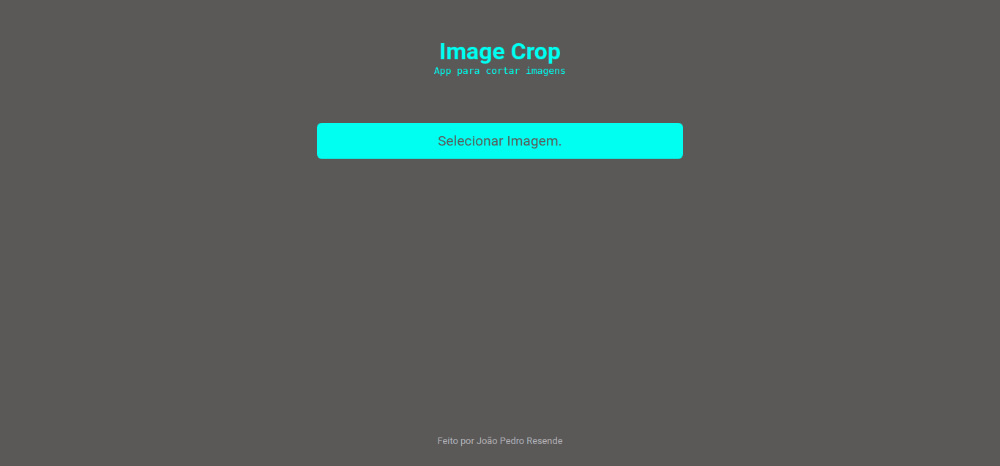

# Image crop

## Projeto para cortar imagens.

    

## Apresentação

O Image crop é um projeto para praticar HTML CSS e JavaScript.

Ele possibilita cortar imagens e baixa-las em seu computador.

## Tecnologias

* HTML5

* Css3

* JavaScript

* CanvasAPI

[Clique aqui para ver o projeto em tempo real!](https://image-crop.jpbrab0.vercel.app)

**Feito por [João Pedro Resende](https://jpres.dev)**